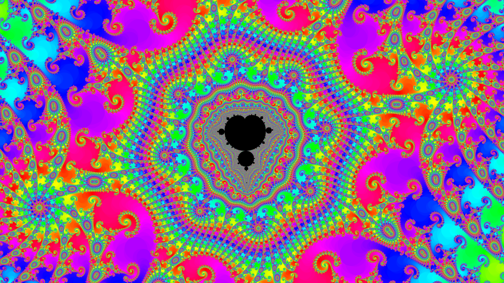

# Complex Function Dynamical visualizer

A lightweight framework for generating PNGs, along with a lightweight framework to generate images based on functions mapping complex numbers to integers. For instance, the function which maps a complex number `c` to the first `n` for which the term in the recursively defined sequence `z_0 = 0`, `z_n = z_{n-1}^2 + c` satisfies `|z_n| > 2`. This allows for the generation of classic mandelbrot set visualizations, after the number of iterations are mapped to colors. Due to the general nature of the framework however, any function from the complex numbers to the integers can be visualized in a similar manner, whether or not the function involve this sort of iteration.

Requires `libpng`.

